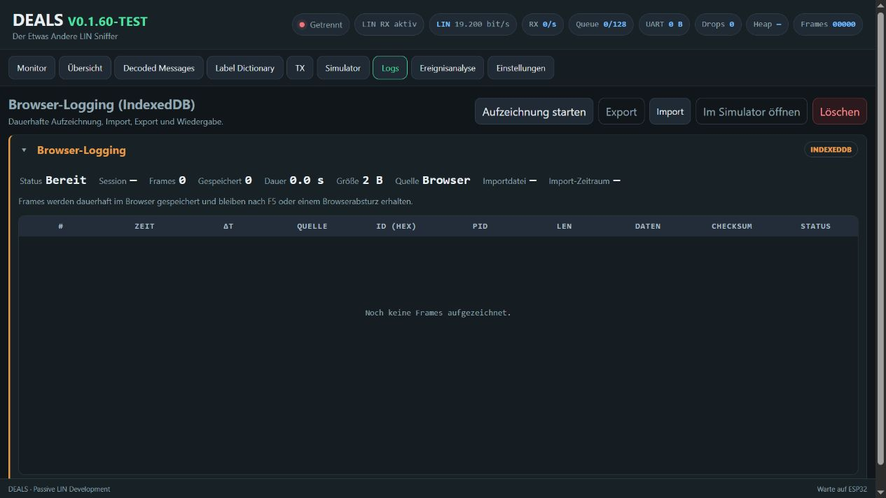
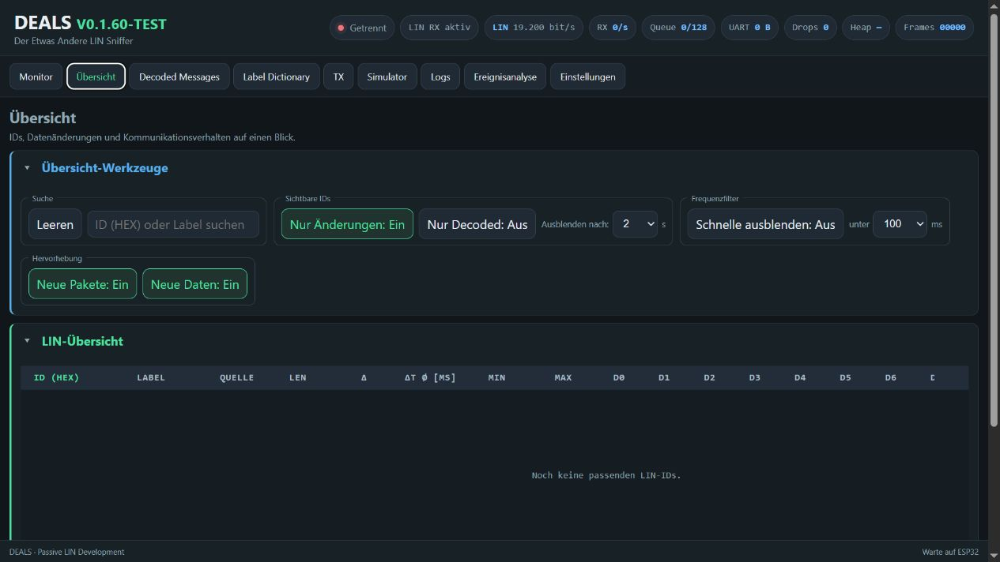
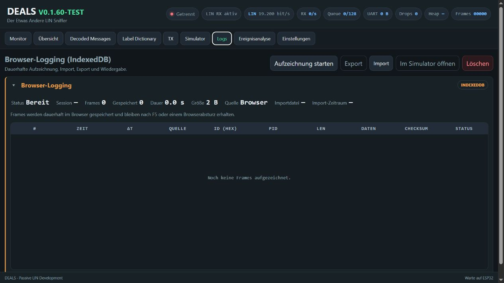
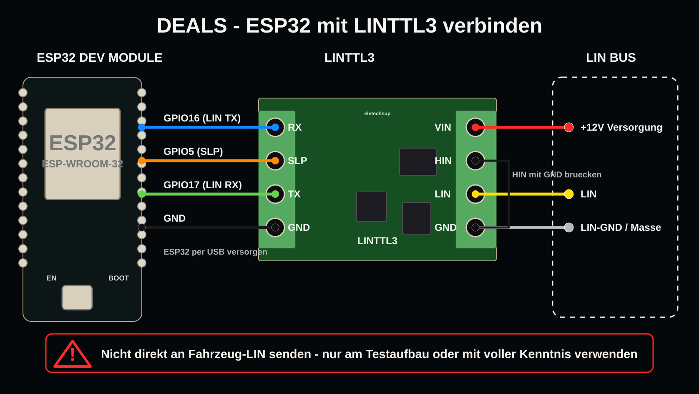

# DEALS V0.1.60-TEST

**Der Etwas Andere LIN Sniffer** ist ein browserbasiertes LIN-Werkzeug fuer den ESP32. Es empfaengt, analysiert, protokolliert, simuliert und sendet LIN-Frames ueber eine UART-Verbindung mit externem LIN-Transceiver.

> Diese Version ist eine TEST-Version. Beim aktiven Senden an einem Fahrzeug-LIN ist besondere Vorsicht erforderlich.







## Funktionen

- Live-Monitor fuer LIN-Frames
- Uebersicht mit ID-, Aenderungs- und Frequenzansicht
- Konfigurierbare ID-Anzeige in Hexadezimal oder Dezimal
- Classic- und Enhanced-Checksumme
- Einzelne und zyklische TX-Frames
- Simulator, Generator und Log-Wiedergabe
- Optionales Live-Senden von Simulator, Generator und Log-Wiedergabe
- Serverfilter zum gezielten Anzeigen oder Ausblenden mehrerer IDs
- Browser-Logging mit Import, Export und Wiedergabe
- Ereignis-Analyse mit Markern, Zeitfenstern sowie Vorher-/Nachher-Vergleich
- LDF-Dateien direkt in der Weboberflaeche verwalten
- Diagnoseanzeigen fuer Queue, Drops, UART-Datenrate und Speicher

## Hardware



- ESP32 Dev Module / ESP32-WROOM-32D
- Externer LIN-Transceiver, zum Beispiel TJA1021, MCP2004 oder kompatibel
- 12-V-LIN-Testaufbau mit passender Versorgung und Massebezug

| Verbindung | Anschluss |
|---|---|
| ESP32 GPIO16 (LIN TX) | LINTTL3 RX |
| ESP32 GPIO17 (LIN RX) | LINTTL3 TX |
| ESP32 GPIO5 | LINTTL3 SLP |
| ESP32 GND | LINTTL3 GND |
| LINTTL3 VIN | +12 V Versorgung |
| LINTTL3 LIN | LIN-Bus |
| LINTTL3 GND | LIN-GND / Masse |
| LINTTL3 HIN | mit GND bruecken |
| Aktivitaets-LED | ESP32 GPIO2 |

Die ESP32-UART-Pins duerfen nicht direkt mit dem LIN-Bus verbunden werden. Es wird immer ein geeigneter LIN-Transceiver benoetigt.

## LIN-Modi

- **Nur Mithoeren:** empfaengt Frames und sendet nicht aktiv auf den Bus.
- **Normal / TX:** sendet einzelne oder zyklische Frames ueber den LIN-Transceiver.
- **Simulator / Generator / Replay:** erzeugt Testdaten fuer die Oberflaeche und kann optional als Live-TX-Quelle verwendet werden.

Die Board-LED zeigt Aktivitaet an. Reine Oberflaechen- oder Simulator-Daten ohne Live-TX beeinflussen keinen angeschlossenen LIN-Bus.

## Installation und Upload

Benoetigt werden [Visual Studio Code](https://code.visualstudio.com/) und [PlatformIO](https://platformio.org/).

1. Repository oeffnen.
2. ESP32 per USB verbinden.
3. In VS Code den Standard-Build-Task **DEALS: Upload complete** starten.

Der Task baut die Firmware und uebertraegt anschliessend Firmware und LittleFS-Weboberflaeche. Alternativ:

```text
pio run
pio run -t upload
pio run -t uploadfs
```

Nach Aenderungen an Dateien unter `data/` muss auch LittleFS erneut hochgeladen werden.

### Komplettes BIN fuer den Browser-Flasher erstellen

Der zusaetzliche VS-Code-Task **DEALS: Web-Flasher BIN erstellen** baut Firmware und LittleFS und verbindet anschliessend alle benoetigten Bestandteile zu einer einzigen Datei:

`release/DEALS_V0_1_60_TEST_webflash.bin`

Der bisherige Task **DEALS: Upload complete** bleibt unveraendert.

### Mit esptool-js flashen

1. Die Datei [`DEALS_V0_1_60_TEST_webflash.bin`](release/DEALS_V0_1_60_TEST_webflash.bin) herunterladen oder mit dem VS-Code-Task **DEALS: Web-Flasher BIN erstellen** lokal erzeugen.
2. [Espressif ESP Tool](https://espressif.github.io/esptool-js/) in Chrome oder Edge oeffnen. Safari wird nicht unterstuetzt.
3. ESP32 per USB verbinden und **Connect** waehlen.
4. Unter **Program** die heruntergeladene Datei auswaehlen.
5. Als Flash-Adresse `0x0` eintragen.
6. **Program** starten und warten, bis das Schreiben abgeschlossen ist.
7. Den ESP32 neu starten und mit dem WLAN `DEALS` verbinden.

Das Gesamt-BIN enthaelt Bootloader, Partitionstabelle, Firmware und die vollstaendige LittleFS-Weboberflaeche. Es darf deshalb ausschliesslich an Adresse `0x0` geflasht werden.

## Erster Start

Der ESP32 stellt einen eigenen WLAN-Access-Point bereit:

| Einstellung | Wert |
|---|---|
| WLAN | `DEALS` |
| Passwort | `deals123` |
| Weboberflaeche | `http://192.168.4.1` |

Nach dem Verbinden mit dem WLAN die Weboberflaeche im Browser oeffnen.

## DEALS und Internet gleichzeitig

Der ESP32 kann den `DEALS`-Access-Point aktiv halten und zusaetzlich einem normalen WLAN beitreten:

1. **Einstellungen > WLAN - AP + Internet** oeffnen.
2. SSID und Passwort des normalen WLANs eintragen.
3. PC im normalen WLAN lassen.
4. DEALS ueber die angezeigte Station-IP oeffnen.

Die Adresse `192.168.4.1` bleibt verfuegbar, wenn der PC direkt mit dem `DEALS`-Access-Point verbunden ist.

## Bedienbereiche

- **Monitor:** fortlaufende Frame-Liste mit Suche, Filtern, Pause und Auto-Scroll
- **Uebersicht:** eine Zeile je LIN-ID mit Zykluszeiten und Byte-Aenderungen
- **Decoded messages:** verwaltete Signale und Byte-Ansicht
- **Label dictionary:** eigene Bezeichnungen fuer LIN-IDs importieren, exportieren und bearbeiten
- **TX:** einzelne oder zyklische Frames konfigurieren
- **Simulator:** Frames erzeugen, importierte Logs abspielen und Generatoren verwalten
- **Logs:** Aufzeichnung, Import, Wiedergabe und Export
- **Ereignis:** Marker setzen und Aenderungen vor und nach einem Ereignis vergleichen
- **Settings:** Baudrate, Checksumme, ID-Darstellung, Live-TX-Quellen, LIN-Filter und LDF-Dateien

## LDF-Dateien

LDF-Dateien koennen in den Einstellungen direkt hinzugefuegt, ausgewaehlt und geloescht werden. Sie werden im LittleFS des ESP32 gespeichert. Manuelle Eintraege im Label Dictionary haben Vorrang vor LDF-Namen.

## Ereignis-Analyse

Die Analyse verwendet die Daten des aktuellen Monitors und speichert beim Setzen eines Markers dessen Quelle. Fuer ein einstellbares Zeitfenster vor und nach dem Marker werden geaenderte IDs, Bytes und Bitpositionen ermittelt. Gleiche Daten oder zyklische Nachrichten koennen ausgeblendet werden.

## Projektstruktur

| Pfad | Inhalt |
|---|---|
| `src/` | ESP32-Firmware |
| `include/` | Konfiguration und Header |
| `data/` | Weboberflaeche und LittleFS-Inhalte |
| `docs/images/` | GUI-Bilder fuer die GitHub-Seite |

## Danksagung

DEALS baut auf der Arbeit zahlreicher Open-Source-Projekte und ihrer Mitwirkenden auf. Besonderer Dank gilt:

- [Arduino Core for the ESP32](https://github.com/espressif/arduino-esp32) als Firmware-Framework
- [PlatformIO](https://github.com/platformio/platformio-core) fuer Build, Abhaengigkeitsverwaltung und Upload
- [arduinoWebSockets](https://github.com/Links2004/arduinoWebSockets) von Markus Sattler und allen Mitwirkenden fuer die WebSocket-Kommunikation

Alle Namen und Marken gehoeren ihren jeweiligen Inhabern. Fuer eingebundene Drittinhalte gelten die jeweiligen Lizenzen und Nutzungsbedingungen der Ursprungsprojekte.

## Sicherheit

Das Senden beliebiger LIN-Frames kann Steuergeraete und Fahrzeugfunktionen beeinflussen. DEALS nur an geeigneten Testaufbauten oder mit vollstaendigem Verstaendnis des angeschlossenen Systems verwenden. Fuer Schaeden durch unsachgemaessen Einsatz wird keine Haftung uebernommen.
